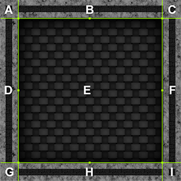

# GD50-pokemon
*Description*

Lecture Slides: [Lecture 7](https://github.com/jazorhe/GD50-pokemon/blob/main/lecture7.pdf)


### Overview
-   [Our Goal](#our-goal)
-   [Lecture Notes](#lecture-notes)
-   [Assignment](#assignment)
-   [Submission](#submission)
-   [Useful Links](#useful-links)


<br>

## Our Goal


## Lecture Notes
**Topics**:
-   [StateStacks](#statestacks)
-   [Turn-Based System](#turn-base-system)
-   [GUIs](#guis)
-   [RPG Mechanics](#topic)


### StateStacks
-   Allows us to return back to states as they were when we left them, rather than create new ones.
-   Can allow us to render multiple states at once.
-   Only the top-most state on the stack is being updated at once, though this could be changed if we wanted it to.

Push layers of stacked states on top of each others so that more than one state can exist at the same time. While usually only the top layer of the stack will be updated, all layers will be rendered. When the top of the stack finished what its doing, we pop remove it from the stack and continue updating the next state. Stack layers or patterns can be further looked into in other courses like OOD or software architecture.

```lua
StateStack = Class{}

function StateStack:init()
    self.states = {}
end

function StateStack:update(dt)
    self.states[#self.states]:update(dt)
end

function StateStack:processAI(params, dt)
    self.states[#self.states]:processAI(params, dt)
end

function StateStack:render()
    for i, state in ipairs(self.states) do
        state:render()
    end
end

function StateStack:clear()
    self.states = {}
end

function StateStack:push(state)
    table.insert(self.states, state)
    state:enter()
end

function StateStack:pop()
    self.states[#self.states]:exit()
    table.remove(self.states)
end
```


```lua
function FadeInState:init(color, time, onFadeComplete)
    self.r = color.r
    self.g = color.g
    self.b = color.b
    self.opacity = 0
    self.time = time

    Timer.tween(self.time, {
        [self] = {opacity = 255}
    })
    :finish(function()
        gStateStack:pop()
        onFadeComplete()
    end)
end
```


'''lua
function StartState:update(dt)
    if love.keyboard.wasPressed('enter') or love.keyboard.wasPressed('return') then
        gStateStack:push(FadeInState({
            r = 255, g = 255, b = 255
        }, 1,
        function()
            gSounds['intro-music']:stop()
            self.tween:remove()
            gStateStack:pop()
            gStateStack:push(PlayState())
            gStateStack:push(DialogueState("" ..
                "Welcome to the world of 50Mon! To start fighting monsters with your own randomly assigned" ..
                " monster, just walk in the tall grass! If you need to heal, just press 'P' in the field! " ..
                "Good luck! (Press Enter to dismiss dialogues)"
            ))
            gStateStack:push(FadeOutState({
                r = 255, g = 255, b = 255
            }, 1,
            function() end))
        end))
    end
end
'''

-   Need to be more familiar with callback functions, this is extremely useful and powerful as demonstrated above. Callback functions can even be called within the parent function by `self.callback` or `self.callback = callback or function() end` to be safe
-   StateStack is not necessary for entities in this use case therefore we are still using a narmal `Enitiy.stateMachine:change('state')`


### Turn-Based System


### GUIs
-   Short for "graphical user interface"
-   Common widgets and elements include Panels, Labels, Textboxes, Scrollbars, and others

#### Panel:
-   Simple Way: Two rectangle with different colours
-   Tranditional Way: Nine Patch


*Simple Representation of the Idea*


Nine Patch is a way of storing and rendering a Graphical User Interface with 9 grids of textures, where the corners of the UI box can be fixed anywhere on the screen, so that one can easily repeat as many side pieces as they want and have flexible box sizes with a uniform look. One can also take the center piece and stretch it across the interior of the box, using a filter or a gradient to create even more aesthetic look when required.



*An Example of What a 9-Patch GUI Can Look Like*

Note that we have created a `Panel:toggle()` function here.

```lua
Panel = Class{}

function Panel:init(x, y, width, height)
    self.x = x
    self.y = y
    self.width = width
    self.height = height

    self.visible = true
end

function Panel:update(dt)

end

function Panel:render()
    if self.visible then
        love.graphics.setColor(255, 255, 255, 255)
        love.graphics.rectangle('fill', self.x, self.y, self.width, self.height, 3)
        love.graphics.setColor(56, 56, 56, 255)
        love.graphics.rectangle('fill', self.x + 2, self.y + 2, self.width - 4, self.height - 4, 3)
        love.graphics.setColor(255, 255, 255, 255)
    end
end

function Panel:toggle()
    self.visible = not self.visible
end
```


#### Textbox:
Maintain a list of text elements and draw them within a box

`self.font:getWrap()` to put text into chunks and split long piece of text into several lines for rendering, and return a table of the chunks

```lua
function Textbox:init(x, y, width, height, text, font)
    self.panel = Panel(x, y, width, height)
    self.x = x
    self.y = y
    self.width = width
    self.height = height

    self.text = text
    self.font = font or gFonts['small']
    _, self.textChunks = self.font:getWrap(self.text, self.width - 12)

    self.chunkCounter = 1
    self.endOfText = false
    self.closed = false

    self:next()
end
```

While going through pages, we keep track of the index of the current chunk being rendered, and if the chunk is the last of the chunk table, we have reached the end of text. If not, we render the current chunk and a few more (depending of the number of lines we need), then iterate over the `textChunks` table

```lua
function Textbox:nextChunks()
    local chunks = {}

    for i = self.chunkCounter, self.chunkCounter + 2 do
        table.insert(chunks, self.textChunks[i])

        -- if we've reached the number of total chunks, we can return
        if i == #self.textChunks then
            self.endOfText = true
            return chunks
        end
    end

    self.chunkCounter = self.chunkCounter + 3

    return chunks
end
```

When reached end of text, toggle the panel and note `self.closed = true`

```lua
function Textbox:next()
    if self.endOfText then
        self.displayingChunks = {}
        self.panel:toggle()
        self.closed = true
    else
        self.displayingChunks = self:nextChunks()
    end
end
```

Rendering using `i` as a multiplier of our `y`, where `i` is the number of lines of text being displayed:

```lua
function Textbox:render()
    self.panel:render()

    love.graphics.setFont(self.font)
    for i = 1, #self.displayingChunks do
        love.graphics.print(self.displayingChunks[i], self.x + 3, self.y + 3 + (i - 1) * 16)
    end
end
```

#### Selection:
Selection can ideally be built into a Class so that you do not have to implement the same logic onto different menu selection you have in the game.

When a selection happens, we should index into the menu items and execute a callback function. Ultimately, to achieve opening a menu -> items -> potion -> Pokemon, you would have to have a series of stacked states with callback functions linked between each others for this sort of complicated behaviour

One thing to note is for a menu, when we are at the top, we press up, we want to go to the bottom, and when we are at the top, we press down, we want to go back to the to
top

```lua
function Selection:update(dt)
    if love.keyboard.wasPressed('up') then
        if self.currentSelection == 1 then
            self.currentSelection = #self.items
        else
            self.currentSelection = self.currentSelection - 1
        end

        gSounds['blip']:stop()
        gSounds['blip']:play()
    elseif love.keyboard.wasPressed('down') then
        if self.currentSelection == #self.items then
            self.currentSelection = 1
        else
            self.currentSelection = self.currentSelection + 1
        end

        gSounds['blip']:stop()
        gSounds['blip']:play()
    elseif love.keyboard.wasPressed('return') or love.keyboard.wasPressed('enter') then
        self.items[self.currentSelection].onSelect()

        gSounds['blip']:stop()
        gSounds['blip']:play()
    end
end
```

Drawing the cursor onto the correct selection item, also need to take care of padding between items:

```lua
function Selection:render()
    local currentY = self.y

    for i = 1, #self.items do
        local paddedY = currentY + (self.gapHeight / 2) - self.font:getHeight() / 2

        -- draw selection marker if we're at the right index
        if i == self.currentSelection then
            love.graphics.draw(gTextures['cursor'], self.x - 8, paddedY)
        end

        love.graphics.printf(self.items[i].text, self.x, paddedY, self.width, 'center')

        currentY = currentY + self.gapHeight
    end
end
```

Lastly, a `Menu` in this project is defined as a `Panel` and a `Selection` being put together. When updating, only update `Seleciton` (because that is all we care about and we do not have a animated `Panel`), and when rendering, we render both.

```lua
function Menu:init(def)
    self.panel = Panel(def.x, def.y, def.width, def.height)

    self.selection = Selection {
        items = def.items,
        x = def.x,
        y = def.y,
        width = def.width,
        height = def.height
    }
end
```


#### Progress Bar:
-   Two rectangles again, with rounded edges and with different colours
-   Change progress bar by tweening the width of the inner rectangle to the correct ratio


### RPG Mechanics
#### Party
Is only a simple party

```lua
function Party:init(def)
    self.pokemon = def.pokemon
end
```

#### Pokemon
Effectively a bunch of necessary stats and updating them. You really have all the numbers and comparing them, then adding in the rolling of a dice.

IV: Roll a dice multiple times and see if the dice number is lower than your IV, if so, the correlated stats can further level up.

```lua
self.baseHP = def.baseHP
self.baseAttack = def.baseAttack
self.baseDefense = def.baseDefense
self.baseSpeed = def.baseSpeed

self.HPIV = def.HPIV
self.attackIV = def.attackIV
self.defenseIV = def.defenseIV
self.speedIV = def.speedIV
```

That means, for each level up, you can have one stat to be incremented 3 (or multiple) times maximum depending on the dice rolls.

```lua
function Pokemon:statsLevelUp()
    local HPIncrease = 0

    for j = 1, 3 do
        if math.random(6) <= self.HPIV then
            self.HP = self.HP + 1
            HPIncrease = HPIncrease + 1
        end
    end

    local attackIncrease = 0

    for j = 1, 3 do
        if math.random(6) <= self.attackIV then
            self.attack = self.attack + 1
            attackIncrease = attackIncrease + 1
        end
    end

    local defenseIncrease = 0

    for j = 1, 3 do
        if math.random(6) <= self.defenseIV then
            self.defense = self.defense + 1
            defenseIncrease = defenseIncrease + 1
        end
    end

    local speedIncrease = 0

    for j = 1, 3 do
        if math.random(6) <= self.speedIV then
            self.speed = self.speed + 1
            speedIncrease = speedIncrease + 1
        end
    end

    return HPIncrease, attackIncrease, defenseIncrease, speedIncrease
end
```

Skills that can change the current attach, defence, speed etc also exist, so we will need `currentAttack`, `currentDefence` etc. However it is not implemented in this demo, only `currentHP` is needed for this demonstration.


#### Data Driven Design
Shifting as much of it to data as you possibly can should be your end goal, including sprites, stats, animations, states etc. In the Pokemon context, even sound effects, skills etc.


### Other Notes
#### Shaders


#### Some Missing Features:
-   Detailed Level-Up Screen
-   Monster Catching
-   Field Menu For Browsing Pokemon
-   Item Inventory
-   Different Abilities
-   Other Trainers to Fight
-   Monster Evolution
-   Town, Routes, and Other Levels
-   Breeding
-   Day/Night Cycle
-   ...

<br>

## Assignment
### Objectives
-   [ ] [**Code Reading**](#code-reading)Read and understand all of **xxxx** source code from Lecture 5.
    -   [ ] [`main.lua`](#mainlua)
    -   [ ] [`file.lua`](#filelua)
    -   [ ] [`file.lua`](#filelua)
    -   [ ] [`file.lua`](#filelua)

-   [ ] [**Task**](#task):
-   [ ] [**Task**](#task):
-   [ ] [**Task**](#task):


<br>

### Code Reading
#### `main.lua`


### Task
*Description*

**The update needs to do the following**: <br>
**How I achieved**: <br>
**Challenge myself**: <br>


### Task
*Description*

**The update needs to do the following**: <br>
**How I achieved**: <br>
**Challenge myself**: <br>


### Task
*Description*

**The update needs to do the following**: <br>
**How I achieved**: <br>
**Challenge myself**: <br>


## Submission


## Useful Links
## Useful Links
-   [LÖVE2d](https://love2d.org/wiki/love)
-   [Lua Knife](https://github.com/airstruck/knife)
-   [Push Module for Lua](https://github.com/Ulydev/push)
-   [Fonts: Dafont.com](https://www.dafont.com/)
-   [Freely Available Game Assets: Open Game Art](https://opengameart.org/)
-   [Sound Effects: Bfxr Sound Effect Generator](https://www.bfxr.net/)
-   [Shader](https://www.shadertoy.com/)
-   Markdown Guides:
    -   [Embed youtube to markdown, GitLab, GitHub](http://embedyoutube.org/)
    -   [GitHub: Mastering Markdown](https://guides.github.com/features/mastering-markdown/)
    -   [Markdown Emoji Cheatsheet](https://github.com/ikatyang/emoji-cheat-sheet/blob/master/README.md)
-   Books and Materials:
    -   [How to Make an RPG](https://howtomakeanrpg.com/)
