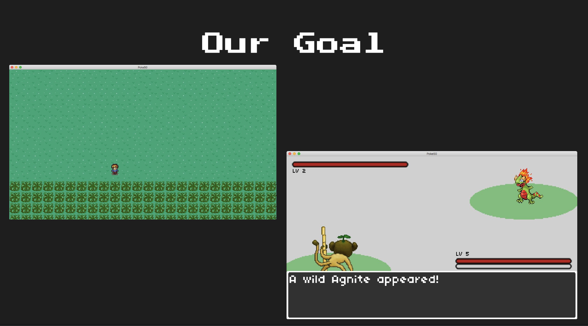

# GD50-pokemon
*Description*

Lecture Slides: [Lecture 7](https://github.com/jazorhe/GD50-pokemon/blob/main/lecture7.pdf)

### Overview
-   [Our Goal](#our-goal)
-   [Lecture Notes](#lecture-notes)
-   [Assignment](#assignment)
-   [Submission](#submission)
-   [Useful Links](#useful-links)

 

## Our Goal

## Lecture Notes
**Topics**:
-   [Topic](#topic)
-   [Topic](#topic)
-   [Topic](#topic)
-   [Topic](#topic)
-   [Topic](#topic)

### Topic
### Topic
### Topic
### Topic
### Topic

### Other Notes

 

## Assignment
### Objectives
-   [ ] [**Code Reading**](#code-reading)Read and understand all of **xxxx** source code from Lecture 5.
    -   [ ] [`main.lua`](#mainlua)
    -   [ ] [`file.lua`](#filelua)
    -   [ ] [`file.lua`](#filelua)
    -   [ ] [`file.lua`](#filelua)

-   [ ] [**Task**](#task):
-   [ ] [**Task**](#task):
-   [ ] [**Task**](#task):

 

### Code Reading
#### `main.lua`

### Task
*Description*

**The update needs to do the following**:  
**How I achieved**:  
**Challenge myself**:  

### Task
*Description*

**The update needs to do the following**:  
**How I achieved**:  
**Challenge myself**:  

### Task
*Description*

**The update needs to do the following**:  
**How I achieved**:  
**Challenge myself**:  

## Submission

## Useful Links
## Useful Links
-   [LÖVE2d](https://love2d.org/wiki/love)
-   [Lua Knife](https://github.com/airstruck/knife)
-   [Push Module for Lua](https://github.com/Ulydev/push)
-   [Fonts: Dafont.com](https://www.dafont.com/)
-   [Freely Available Game Assets: Open Game Art](https://opengameart.org/)
-   [Sound Effects: Bfxr Sound Effect Generator](https://www.bfxr.net/)
-   Markdown Guides:
    -   [Embed youtube to markdown, GitLab, GitHub](http://embedyoutube.org/)
    -   [GitHub: Mastering Markdown](https://guides.github.com/features/mastering-markdown/)
    -   [Markdown Emoji Cheatsheet](https://github.com/ikatyang/emoji-cheat-sheet/blob/master/README.md)
